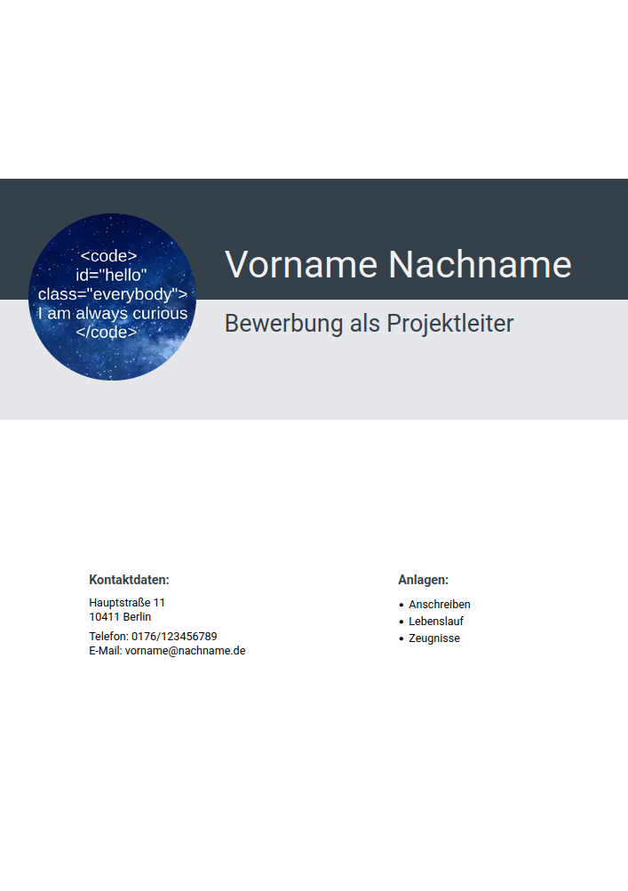
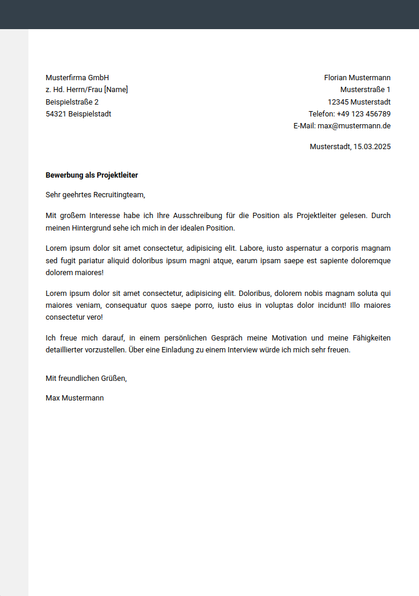
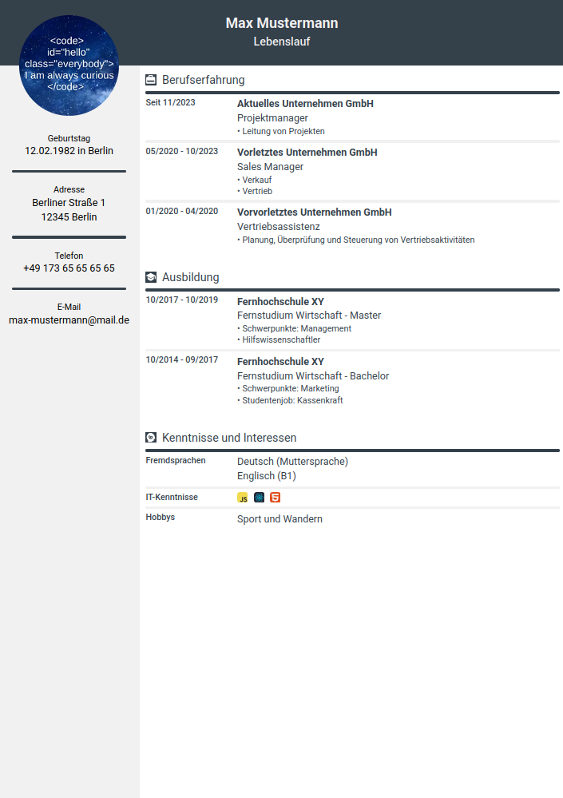

# Application documents (Curriculum vitae / Résumé, cover-letter and cover)

As I was looking for a layout for my CV, I thought about making my own - with HTML and Tailwind CSS by using Astro.

The documents are only a rough template; the font and font size, colors and structure can be adapted as desired. Have fun :)

## Template - blank web page (DIN-A4)

https://blog.ronanru.com/resume-html-tailwind-css/

## Layout inspiration

https://lebenslaufdesigns.de/
